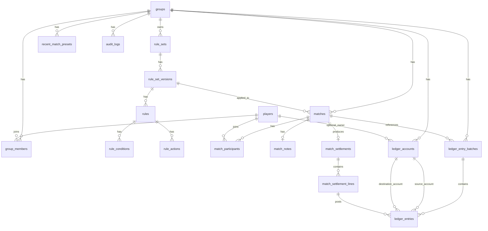

# Thiết kế Database cho hệ thống LolChess TFT History Manager

## 1) Mục tiêu thiết kế

Database này được thiết kế để đáp ứng đầy đủ nghiệp vụ của hệ thống quản lý lịch sử đấu TFT cho nhóm bạn, đồng thời vẫn đủ linh hoạt để mở rộng về sau.

Mục tiêu chính:

- lưu lịch sử trận đấu TFT theo **2 luồng kế toán tách biệt**:
  - **Match Stakes**: tiền thắng/thua trực tiếp giữa người chơi
  - **Group Fund**: tiền nộp vào / rút ra khỏi quỹ nhóm
- hỗ trợ **rule engine cấu hình được**, không hard-code logic rải rác trong code
- lưu được **snapshot rule tại thời điểm tính toán trận** để đảm bảo audit
- lưu được **kết quả settlement chi tiết theo từng rule** và từng dòng tiền
- hỗ trợ truy vấn:
  - lịch sử trận đấu
  - chi tiết trận đấu
  - lịch sử biến động nợ
  - lịch sử biến động quỹ
  - tổng hợp lời/lỗ theo người chơi
  - số tiền mỗi người đang nợ quỹ
- hỗ trợ UX nhập nhanh trên mobile bằng cách nhớ **preset lần nhập gần nhất**
- tương thích tốt với **PostgreSQL + Drizzle ORM**

---

## 2) Các giả định thiết kế được chốt rõ

Do nghiệp vụ có một số điểm chưa nói tuyệt đối chi tiết, database chốt các giả định sau để đủ rõ cho việc implement:

### 2.1. Mỗi trận chỉ thuộc đúng 1 module

- `MATCH_STAKES`
- `GROUP_FUND`

Một trận không thể đồng thời thuộc cả hai module.

### 2.2. Rule set được version hóa

Khi sửa rule set, hệ thống **không ghi đè lịch sử**, mà tạo version mới.
Vì vậy mỗi trận sẽ tham chiếu đến **rule set version** đã dùng khi tính toán.

### 2.3. Tiền luôn lưu bằng số nguyên VND

- dùng kiểu `BIGINT`
- không dùng float / decimal cho số tiền nghiệp vụ

### 2.4. Thời gian lưu bằng `timestamptz`

- lưu UTC trong database
- mỗi group có thể có `timezone` riêng, mặc định đề xuất: `Asia/Ho_Chi_Minh`
- UI chuyển đổi khi hiển thị

### 2.5. Penalty phải chỉ rõ nguồn và đích

Do nghiệp vụ yêu cầu rule có thể thay đổi nguồn/đích, hệ thống **không hard-code “tiền phạt đi về đâu”**.
Mỗi action trong rule sẽ chỉ rõ:

- account nguồn
- account đích
- selector để xác định player/fund tương ứng

### 2.6. Manual adjustment là cần thiết

Ngoài match-generated settlement, hệ thống nên hỗ trợ bút toán điều chỉnh tay trong tương lai để:

- cộng/trừ quỹ thủ công
- chỉnh nợ sai
- hoàn tiền / reset một phần

Vì vậy schema có ledger tổng quát thay vì chỉ dựa vào match.

---

## 3) Nguyên tắc thiết kế dữ liệu

1. **Tách domain match khỏi domain accounting**  
   Match là dữ liệu đầu vào nghiệp vụ; accounting là dữ liệu phát sinh sau tính toán.

2. **Settlement và Ledger là 2 lớp khác nhau**  
   - `match_settlement*`: kết quả tính toán theo rule engine
   - `ledger_*`: dữ liệu ghi sổ kế toán / lịch sử biến động tiền

3. **Rule engine data-driven**  
   Rule được mô tả bằng dữ liệu (`rule_sets`, `rules`, `rule_conditions`, `rule_actions`), không hard-code toàn bộ bằng if/else.

4. **Có snapshot để audit**  
   Khi trận được chốt, toàn bộ đầu vào và output quan trọng cần truy vết được về sau.

5. **Tối ưu cho MVP nhưng không khóa khả năng mở rộng**  
   MVP chỉ cần 3 hoặc 4 người chơi, nhưng schema không nên chặn việc mở rộng participant count sau này.

---

## 4) Danh sách enum khuyến nghị

### 4.1. `module_type`

- `MATCH_STAKES`
- `GROUP_FUND`

### 4.2. `match_status`

- `DRAFT`
- `CALCULATED`
- `POSTED`
- `VOIDED`

> MVP có thể chủ yếu dùng `POSTED` sau khi lưu và tính toán thành công.

### 4.3. `account_type`

- `PLAYER_DEBT`
- `FUND_MAIN`
- `PLAYER_FUND_OBLIGATION`
- `SYSTEM_HOLDING`

### 4.4. `ledger_source_type`

- `MATCH_SETTLEMENT`
- `MANUAL_ADJUSTMENT`
- `SYSTEM_CORRECTION`

### 4.5. `rule_status`

- `ACTIVE`
- `INACTIVE`

### 4.6. `rule_kind`

- `BASE_RELATIVE_RANK`
- `ABSOLUTE_PLACEMENT_MODIFIER`
- `PAIR_CONDITION_MODIFIER`
- `FUND_CONTRIBUTION`
- `CUSTOM`

### 4.7. `condition_operator`

- `EQ`
- `NEQ`
- `GT`
- `GTE`
- `LT`
- `LTE`
- `IN`
- `NOT_IN`
- `BETWEEN`
- `CONTAINS`

### 4.8. `action_type`

- `TRANSFER`
- `POST_TO_FUND`
- `CREATE_OBLIGATION`
- `REDUCE_OBLIGATION`

### 4.9. `selector_type`

- `PLAYER_BY_RELATIVE_RANK`
- `PLAYER_BY_ABSOLUTE_PLACEMENT`
- `MATCH_WINNER`
- `MATCH_RUNNER_UP`
- `FUND_ACCOUNT`
- `SYSTEM_ACCOUNT`
- `FIXED_PLAYER`

### 4.10. `audit_action_type`

- `CREATE`
- `UPDATE`
- `DELETE`
- `CALCULATE`
- `POST`
- `VOID`

---

## 5) Sơ đồ ERD tổng quan

---

## 6) Mô hình bảng chi tiết

## 6.1. `groups`

### Mục đích
Lưu thông tin nhóm bạn chơi TFT. Đây là root aggregate chính của hệ thống.

### Cột đề xuất

- `id` UUID PK
- `code` VARCHAR(50) UNIQUE NOT NULL
- `name` VARCHAR(150) NOT NULL
- `timezone` VARCHAR(100) NOT NULL DEFAULT `'Asia/Ho_Chi_Minh'`
- `currency_code` VARCHAR(10) NOT NULL DEFAULT `'VND'`
- `is_active` BOOLEAN NOT NULL DEFAULT TRUE
- `created_at` TIMESTAMPTZ NOT NULL DEFAULT now()
- `updated_at` TIMESTAMPTZ NOT NULL DEFAULT now()

### Ghi chú
- `timezone` rất quan trọng để hiển thị đúng ngày giờ của match.
- Với side project, thường chỉ có 1 group, nhưng giữ cấu trúc multi-group để mở rộng dễ hơn.

---

## 6.2. `players`

### Mục đích
Lưu hồ sơ người chơi.

### Cột đề xuất

- `id` UUID PK
- `display_name` VARCHAR(120) NOT NULL
- `slug` VARCHAR(120) UNIQUE NULL
- `avatar_url` TEXT NULL
- `is_active` BOOLEAN NOT NULL DEFAULT TRUE
- `created_at` TIMESTAMPTZ NOT NULL DEFAULT now()
- `updated_at` TIMESTAMPTZ NOT NULL DEFAULT now()

### Ghi chú
- Không gắn thẳng `group_id` vào bảng này để linh hoạt nếu 1 player có thể tham gia nhiều group sau này.
- Nếu chắc chắn chỉ 1 group duy nhất mãi mãi, có thể đơn giản hóa bằng cách thêm `primary_group_id` trực tiếp vào `players`.

---

## 6.3. `group_members`

### Mục đích
Bảng liên kết player với group.

### Cột đề xuất

- `id` UUID PK
- `group_id` UUID NOT NULL FK -> `groups.id`
- `player_id` UUID NOT NULL FK -> `players.id`
- `is_primary` BOOLEAN NOT NULL DEFAULT TRUE
- `joined_at` TIMESTAMPTZ NOT NULL DEFAULT now()
- `left_at` TIMESTAMPTZ NULL
- `is_active` BOOLEAN NOT NULL DEFAULT TRUE

### Constraint / Index

- UNIQUE (`group_id`, `player_id`)
- INDEX (`group_id`, `is_active`)

### Ghi chú
- Dùng bảng này để filter danh sách người chơi đang hoạt động theo group.

---

## 6.4. `rule_sets`

### Mục đích
Lưu metadata của một rule set ở mức business.
Ví dụ:

- `Match Stakes - Default`
- `Group Fund - 3 Players Default`

### Cột đề xuất

- `id` UUID PK
- `group_id` UUID NULL FK -> `groups.id`
- `module` `module_type` NOT NULL
- `code` VARCHAR(80) NOT NULL
- `name` VARCHAR(150) NOT NULL
- `description` TEXT NULL
- `status` `rule_status` NOT NULL DEFAULT `ACTIVE`
- `is_default` BOOLEAN NOT NULL DEFAULT FALSE
- `created_at` TIMESTAMPTZ NOT NULL DEFAULT now()
- `updated_at` TIMESTAMPTZ NOT NULL DEFAULT now()

### Constraint / Index

- UNIQUE (`group_id`, `code`)
- INDEX (`group_id`, `module`, `status`)

### Ghi chú
- `group_id` có thể NULL nếu muốn có global rule template dùng chung.
- Bảng này chỉ là “vỏ” logic, chi tiết rule thật nằm ở version.

---

## 6.5. `rule_set_versions`

### Mục đích
Version hóa rule set để sửa rule không làm thay đổi lịch sử trận cũ.

### Cột đề xuất

- `id` UUID PK
- `rule_set_id` UUID NOT NULL FK -> `rule_sets.id`
- `version_no` INTEGER NOT NULL
- `participant_count_min` SMALLINT NOT NULL
- `participant_count_max` SMALLINT NOT NULL
- `effective_from` TIMESTAMPTZ NOT NULL DEFAULT now()
- `effective_to` TIMESTAMPTZ NULL
- `is_active` BOOLEAN NOT NULL DEFAULT TRUE
- `summary_json` JSONB NULL
- `created_at` TIMESTAMPTZ NOT NULL DEFAULT now()

### Constraint / Index

- UNIQUE (`rule_set_id`, `version_no`)
- INDEX (`rule_set_id`, `is_active`)
- INDEX (`effective_from`, `effective_to`)

### Ghi chú
- Với MVP 3 hoặc 4 người chơi, có thể set:
  - `participant_count_min = 3`, `participant_count_max = 3`
  - hoặc `4, 4`
- `summary_json` dùng để lưu nhanh cấu hình dễ đọc cho UI/admin.

---

## 6.6. `rules`

### Mục đích
Lưu từng rule cụ thể trong một version.

### Ví dụ

- base payout cho match 3 người
- base payout cho match 4 người
- top1-top2 penalty
- top8 penalty
- fund contribution cho người hạng 2 tương đối
- fund contribution cho người hạng 3 tương đối

### Cột đề xuất

- `id` UUID PK
- `rule_set_version_id` UUID NOT NULL FK -> `rule_set_versions.id`
- `code` VARCHAR(100) NOT NULL
- `name` VARCHAR(150) NOT NULL
- `description` TEXT NULL
- `rule_kind` `rule_kind` NOT NULL
- `priority` INTEGER NOT NULL DEFAULT 100
- `status` `rule_status` NOT NULL DEFAULT `ACTIVE`
- `stop_processing_on_match` BOOLEAN NOT NULL DEFAULT FALSE
- `metadata_json` JSONB NULL
- `created_at` TIMESTAMPTZ NOT NULL DEFAULT now()
- `updated_at` TIMESTAMPTZ NOT NULL DEFAULT now()

### Constraint / Index

- UNIQUE (`rule_set_version_id`, `code`)
- INDEX (`rule_set_version_id`, `priority`, `status`)

### Ghi chú
- `priority` cho phép engine chạy rule theo pipeline.
- `metadata_json` có thể lưu hint UI hoặc công thức hiển thị.

---

## 6.7. `rule_conditions`

### Mục đích
Lưu điều kiện áp dụng rule.

### Cột đề xuất

- `id` UUID PK
- `rule_id` UUID NOT NULL FK -> `rules.id`
- `condition_key` VARCHAR(100) NOT NULL
- `operator` `condition_operator` NOT NULL
- `value_json` JSONB NOT NULL
- `sort_order` INTEGER NOT NULL DEFAULT 1
- `created_at` TIMESTAMPTZ NOT NULL DEFAULT now()

### Ví dụ dữ liệu

#### Rule: 3-player winner +100000
- `condition_key = 'participant_count'`, `operator = EQ`, `value_json = 3`
- `condition_key = 'relative_rank'`, `operator = EQ`, `value_json = 1`

#### Rule: top1-top2 penalty
- `condition_key = 'match_contains_absolute_placements'`, `operator = CONTAINS`, `value_json = [1,2]`
- `condition_key = 'target_absolute_placement'`, `operator = EQ`, `value_json = 2`

#### Rule: top8 penalty
- `condition_key = 'target_absolute_placement'`, `operator = EQ`, `value_json = 8`

### Ghi chú
- `value_json` giúp tránh phải đổi schema khi thêm loại điều kiện mới.

---

## 6.8. `rule_actions`

### Mục đích
Lưu hành động phát sinh khi rule match điều kiện.
Đây là bảng cực kỳ quan trọng để hiện thực yêu cầu “source/destination account explicit”.

### Cột đề xuất

- `id` UUID PK
- `rule_id` UUID NOT NULL FK -> `rules.id`
- `action_type` `action_type` NOT NULL
- `amount_vnd` BIGINT NOT NULL
- `source_selector_type` `selector_type` NOT NULL
- `source_selector_json` JSONB NULL
- `destination_selector_type` `selector_type` NOT NULL
- `destination_selector_json` JSONB NULL
- `description_template` TEXT NULL
- `sort_order` INTEGER NOT NULL DEFAULT 1
- `created_at` TIMESTAMPTZ NOT NULL DEFAULT now()

### Ví dụ cấu hình

#### Match Stakes 3 người
- winner +100000:  
  không nên lưu theo kiểu “cộng cho winner” một chiều, mà nên tạo 2 rule/action transfer:
  - loser rank 2 -> winner: 50000
  - loser rank 3 -> winner: 50000

Hoặc engine có thể diễn giải payout matrix thành nhiều transfer lines.

#### Top1-top2 penalty
- source selector: `PLAYER_BY_ABSOLUTE_PLACEMENT` with `{ "placement": 2 }`
- destination selector: `PLAYER_BY_ABSOLUTE_PLACEMENT` with `{ "placement": 1 }`
- amount: `10000`

#### Top8 penalty
- source selector: `PLAYER_BY_ABSOLUTE_PLACEMENT` with `{ "placement": 8 }`
- destination selector: `MATCH_WINNER`
- amount: `10000`

#### Group Fund contribution
- source selector: `PLAYER_BY_RELATIVE_RANK` with `{ "relativeRank": 2 }`
- destination selector: `FUND_ACCOUNT`
- amount: `X`

### Ghi chú
- `description_template` phục vụ render breakdown như:  
  `"{sourcePlayer} trả {amount} cho {destinationPlayer} vì luật top1-top2 penalty"`

---

## 6.9. `matches`

### Mục đích
Bảng trung tâm lưu một trận TFT được nhập vào hệ thống.

### Cột đề xuất

- `id` UUID PK
- `group_id` UUID NOT NULL FK -> `groups.id`
- `module` `module_type` NOT NULL
- `rule_set_id` UUID NOT NULL FK -> `rule_sets.id`
- `rule_set_version_id` UUID NOT NULL FK -> `rule_set_versions.id`
- `played_at` TIMESTAMPTZ NOT NULL
- `participant_count` SMALLINT NOT NULL
- `status` `match_status` NOT NULL DEFAULT `POSTED`
- `note_preview` VARCHAR(255) NULL
- `input_snapshot_json` JSONB NOT NULL
- `calculation_snapshot_json` JSONB NULL
- `created_at` TIMESTAMPTZ NOT NULL DEFAULT now()
- `updated_at` TIMESTAMPTZ NOT NULL DEFAULT now()

### Constraint / Index

- CHECK (`participant_count >= 2`)
- INDEX (`group_id`, `module`, `played_at` DESC)
- INDEX (`rule_set_version_id`)
- INDEX (`status`)

### Ghi chú
- `input_snapshot_json` nên lưu raw input của form tại thời điểm submit để audit.
- `calculation_snapshot_json` có thể lưu output tổng hợp của engine để debug nhanh.
- `note_preview` là bản rút gọn cho danh sách; note dài lưu riêng ở bảng `match_notes`.

---

## 6.10. `match_participants`

### Mục đích
Lưu người tham gia trận và thứ hạng TFT thực tế của họ.

### Cột đề xuất

- `id` UUID PK
- `match_id` UUID NOT NULL FK -> `matches.id`
- `player_id` UUID NOT NULL FK -> `players.id`
- `seat_no` SMALLINT NULL
- `tft_placement` SMALLINT NOT NULL
- `relative_rank` SMALLINT NOT NULL
- `is_winner_among_participants` BOOLEAN NOT NULL DEFAULT FALSE
- `settlement_net_vnd` BIGINT NOT NULL DEFAULT 0
- `created_at` TIMESTAMPTZ NOT NULL DEFAULT now()

### Constraint / Index

- UNIQUE (`match_id`, `player_id`)
- UNIQUE (`match_id`, `tft_placement`)
- INDEX (`player_id`, `match_id`)
- CHECK (`tft_placement BETWEEN 1 AND 8`)
- CHECK (`relative_rank >= 1`)

### Ghi chú
- `relative_rank` được tính trong phạm vi người tham gia trận, rất quan trọng cho rule base payout.
- `settlement_net_vnd` là tổng ròng của player trong trận đó để query summary nhanh hơn.

---

## 6.11. `match_notes`

### Mục đích
Lưu note chi tiết của trận.

### Cột đề xuất

- `match_id` UUID PK FK -> `matches.id`
- `note_text` TEXT NOT NULL
- `created_at` TIMESTAMPTZ NOT NULL DEFAULT now()
- `updated_at` TIMESTAMPTZ NOT NULL DEFAULT now()

### Ghi chú
- Tách riêng để bảng `matches` gọn hơn.
- UI có thể join khi xem detail.

---

## 6.12. `match_settlements`

### Mục đích
Header của kết quả tính toán settlement cho một trận.

### Cột đề xuất

- `id` UUID PK
- `match_id` UUID NOT NULL UNIQUE FK -> `matches.id`
- `module` `module_type` NOT NULL
- `total_transfer_vnd` BIGINT NOT NULL DEFAULT 0
- `total_fund_in_vnd` BIGINT NOT NULL DEFAULT 0
- `total_fund_out_vnd` BIGINT NOT NULL DEFAULT 0
- `engine_version` VARCHAR(50) NOT NULL
- `rule_snapshot_json` JSONB NOT NULL
- `result_snapshot_json` JSONB NOT NULL
- `posted_to_ledger_at` TIMESTAMPTZ NULL
- `created_at` TIMESTAMPTZ NOT NULL DEFAULT now()

### Ghi chú
- `rule_snapshot_json` là dữ liệu cực quan trọng để bảo toàn lịch sử.
- `result_snapshot_json` có thể là breakdown đã chuẩn hóa để render nhanh ở UI.

---

## 6.13. `match_settlement_lines`

### Mục đích
Lưu từng dòng settlement được engine sinh ra.
Đây là bảng quan trọng nhất để giải thích “vì sao player được cộng/trừ bao nhiêu”.

### Cột đề xuất

- `id` UUID PK
- `match_settlement_id` UUID NOT NULL FK -> `match_settlements.id`
- `rule_id` UUID NULL FK -> `rules.id`
- `rule_code` VARCHAR(100) NOT NULL
- `rule_name` VARCHAR(150) NOT NULL
- `line_no` INTEGER NOT NULL
- `source_account_id` UUID NOT NULL FK -> `ledger_accounts.id`
- `destination_account_id` UUID NOT NULL FK -> `ledger_accounts.id`
- `source_player_id` UUID NULL FK -> `players.id`
- `destination_player_id` UUID NULL FK -> `players.id`
- `amount_vnd` BIGINT NOT NULL
- `reason_text` TEXT NOT NULL
- `metadata_json` JSONB NULL
- `created_at` TIMESTAMPTZ NOT NULL DEFAULT now()

### Constraint / Index

- UNIQUE (`match_settlement_id`, `line_no`)
- INDEX (`match_settlement_id`)
- INDEX (`source_player_id`)
- INDEX (`destination_player_id`)
- INDEX (`rule_code`)

### Ví dụ dữ liệu

#### Match Stakes 3 người
- A trả B 50000 vì base payout
- C trả B 50000 vì base payout
- C trả B 10000 vì top8 penalty

#### Group Fund
- A trả Fund 10000 vì fund contribution
- B trả Fund 20000 vì fund contribution

### Ghi chú
- `source_account_id` và `destination_account_id` bảo đảm rule có thể đổi nguồn/đích trong tương lai mà không đổi schema.

---

## 6.14. `ledger_accounts`

### Mục đích
Chuẩn hóa các account tham gia vào settlement và ledger.

### Loại account chính

1. **PLAYER_DEBT**  
   đại diện số dư lời/lỗ của một player trong luồng Match Stakes

2. **FUND_MAIN**  
   đại diện số dư quỹ của group

3. **PLAYER_FUND_OBLIGATION**  
   đại diện phần player còn nợ quỹ

4. **SYSTEM_HOLDING**  
   tài khoản hệ thống dự phòng nếu sau này có nhu cầu trung gian

### Cột đề xuất

- `id` UUID PK
- `group_id` UUID NOT NULL FK -> `groups.id`
- `account_type` `account_type` NOT NULL
- `player_id` UUID NULL FK -> `players.id`
- `name` VARCHAR(150) NOT NULL
- `currency_code` VARCHAR(10) NOT NULL DEFAULT `'VND'`
- `is_active` BOOLEAN NOT NULL DEFAULT TRUE
- `created_at` TIMESTAMPTZ NOT NULL DEFAULT now()

### Constraint / Index

- UNIQUE (`group_id`, `account_type`, `player_id`)
- INDEX (`group_id`, `account_type`)

### Ghi chú
- Với `FUND_MAIN`, `player_id` sẽ NULL.
- Với `PLAYER_DEBT` và `PLAYER_FUND_OBLIGATION`, `player_id` bắt buộc có.

---

## 6.15. `ledger_entry_batches`

### Mục đích
Header của một đợt ghi sổ.
Mỗi lần post settlement hoặc tạo manual adjustment sẽ tạo 1 batch.

### Cột đề xuất

- `id` UUID PK
- `group_id` UUID NOT NULL FK -> `groups.id`
- `module` `module_type` NOT NULL
- `source_type` `ledger_source_type` NOT NULL
- `match_id` UUID NULL FK -> `matches.id`
- `reference_code` VARCHAR(100) NULL
- `description` TEXT NULL
- `posted_at` TIMESTAMPTZ NOT NULL DEFAULT now()
- `created_at` TIMESTAMPTZ NOT NULL DEFAULT now()

### Constraint / Index

- INDEX (`group_id`, `module`, `posted_at` DESC)
- INDEX (`match_id`)

### Ghi chú
- Dùng batch để nhóm nhiều ledger entry của cùng một event.

---

## 6.16. `ledger_entries`

### Mục đích
Lưu lịch sử biến động tiền thực tế, là nguồn dữ liệu cho:

- Debt movement history
- Fund increase/decrease history
- tổng hợp lời/lỗ
- truy vết từng bút toán

### Cột đề xuất

- `id` UUID PK
- `batch_id` UUID NOT NULL FK -> `ledger_entry_batches.id`
- `match_settlement_line_id` UUID NULL FK -> `match_settlement_lines.id`
- `source_account_id` UUID NOT NULL FK -> `ledger_accounts.id`
- `destination_account_id` UUID NOT NULL FK -> `ledger_accounts.id`
- `amount_vnd` BIGINT NOT NULL
- `entry_reason` TEXT NOT NULL
- `entry_order` INTEGER NOT NULL DEFAULT 1
- `created_at` TIMESTAMPTZ NOT NULL DEFAULT now()

### Constraint / Index

- INDEX (`batch_id`)
- INDEX (`source_account_id`, `created_at` DESC)
- INDEX (`destination_account_id`, `created_at` DESC)
- INDEX (`match_settlement_line_id`)

### Ghi chú
- Nếu match đã được settlement và posted, mỗi `match_settlement_line` thường sinh đúng 1 `ledger_entry`.
- Manual adjustment có thể vào ledger mà không cần `match_settlement_line_id`.

---

## 6.17. `recent_match_presets`

### Mục đích
Hỗ trợ UX “nhớ lần nhập gần nhất”.

### Cột đề xuất

- `id` UUID PK
- `group_id` UUID NOT NULL FK -> `groups.id`
- `module` `module_type` NOT NULL
- `last_rule_set_id` UUID NULL FK -> `rule_sets.id`
- `last_rule_set_version_id` UUID NULL FK -> `rule_set_versions.id`
- `last_selected_player_ids_json` JSONB NOT NULL
- `last_participant_count` SMALLINT NOT NULL
- `last_used_at` TIMESTAMPTZ NOT NULL DEFAULT now()
- `created_at` TIMESTAMPTZ NOT NULL DEFAULT now()
- `updated_at` TIMESTAMPTZ NOT NULL DEFAULT now()

### Constraint / Index

- UNIQUE (`group_id`, `module`)

### Ghi chú
- Có thể lưu theo module để màn Match Stakes và Group Fund nhớ preset riêng.
- `last_selected_player_ids_json` nên là array theo đúng thứ tự UI đã dùng.

---

## 6.18. `audit_logs`

### Mục đích
Lưu log phục vụ audit thay đổi dữ liệu quan trọng.

### Cột đề xuất

- `id` UUID PK
- `group_id` UUID NULL FK -> `groups.id`
- `entity_type` VARCHAR(100) NOT NULL
- `entity_id` UUID NOT NULL
- `action_type` `audit_action_type` NOT NULL
- `before_json` JSONB NULL
- `after_json` JSONB NULL
- `metadata_json` JSONB NULL
- `created_at` TIMESTAMPTZ NOT NULL DEFAULT now()

### Ghi chú
- Rất hữu ích khi sửa rule, void match, chỉnh manual adjustment.

---

## 7) Quan hệ nghiệp vụ quan trọng

## 7.1. Tách 2 luồng kế toán

### Match Stakes

- input: `matches` + `match_participants`
- rule config: `rule_set_versions` + `rules` + `rule_conditions` + `rule_actions`
- output tính toán: `match_settlements` + `match_settlement_lines`
- ghi sổ: `ledger_entry_batches` + `ledger_entries`
- account tham gia chủ yếu:
  - `PLAYER_DEBT`

### Group Fund

- input: `matches` + `match_participants`
- rule config: `rule_set_versions` + `rules` + `rule_conditions` + `rule_actions`
- output tính toán: `match_settlements` + `match_settlement_lines`
- ghi sổ: `ledger_entry_batches` + `ledger_entries`
- account tham gia chủ yếu:
  - `FUND_MAIN`
  - `PLAYER_FUND_OBLIGATION`

---

## 7.2. Vì sao cần cả `match_settlement_lines` và `ledger_entries`

### `match_settlement_lines`
Phục vụ **giải thích tính toán**:

- rule nào được áp dụng
- nguồn/đích theo rule
- số tiền bao nhiêu
- vì sao phát sinh dòng này

### `ledger_entries`
Phục vụ **ghi sổ và lịch sử biến động**:

- có thể bao gồm cả adjustment không sinh từ match
- là nguồn chuẩn cho history / summary / accounting report

> Tóm lại:  
> `match_settlement_lines` = “engine nói gì”  
> `ledger_entries` = “sổ cái đã ghi gì”

---

## 8) Luồng dữ liệu khi tạo match

## 8.1. Input

Người dùng tạo match với:

- module
- played_at
- danh sách 3 hoặc 4 players
- `tft_placement` của từng player
- rule set được chọn
- note

## 8.2. Persist đầu vào

Ghi vào:

- `matches`
- `match_participants`
- `match_notes` (nếu có)

## 8.3. Tính toán settlement

Engine đọc:

- participants
- placement thực tế
- relative rank
- rule set version
- rule definitions

Engine sinh:

- `match_settlements`
- `match_settlement_lines`

## 8.4. Post vào ledger

Tạo:

- `ledger_entry_batches`
- `ledger_entries`

## 8.5. Cập nhật preset

Update bảng:

- `recent_match_presets`

---

## 9) Cách model đáp ứng từng yêu cầu nghiệp vụ

## 9.1. Lưu lịch sử trận đấu

Dùng:

- `matches`
- `match_participants`
- `match_notes`

## 9.2. Chọn module cho từng trận

Dùng cột:

- `matches.module`

## 9.3. Chọn rule set khi tạo trận

Dùng cột:

- `matches.rule_set_id`
- `matches.rule_set_version_id`

## 9.4. Nhớ preset lần nhập gần nhất

Dùng bảng:

- `recent_match_presets`

## 9.5. Tính lời/lỗ theo Match Stakes

Dùng:

- `match_settlement_lines`
- `ledger_entries`
- `ledger_accounts` loại `PLAYER_DEBT`

## 9.6. Tính quỹ nhóm / nợ quỹ

Dùng:

- `ledger_accounts` loại `FUND_MAIN`
- `ledger_accounts` loại `PLAYER_FUND_OBLIGATION`
- `ledger_entries`

## 9.7. Breakdown vì sao player được cộng/trừ tiền

Dùng:

- `match_settlement_lines.rule_code`
- `match_settlement_lines.rule_name`
- `match_settlement_lines.reason_text`
- `match_settlement_lines.metadata_json`

## 9.8. Có thể sửa rule mà không đổi logic code chính

Dùng:

- `rule_sets`
- `rule_set_versions`
- `rules`
- `rule_conditions`
- `rule_actions`

## 9.9. Auditability

Dùng:

- `matches.input_snapshot_json`
- `matches.calculation_snapshot_json`
- `match_settlements.rule_snapshot_json`
- `match_settlements.result_snapshot_json`
- `audit_logs`

---

## 10) Thiết kế rule engine ở mức database

## 10.1. Base relative rank rule

Áp dụng cho các rule kiểu:

- 3 người: hạng 1 tương đối thắng 100k, 2 người còn lại thua 50k
- 4 người: hạng 1 +70k, hạng 2 +30k, 2 người còn lại -50k

Cách lưu:

- `rules.rule_kind = BASE_RELATIVE_RANK`
- `rule_conditions` mô tả participant count và relative rank
- `rule_actions` mô tả source/destination transfer

## 10.2. Absolute placement modifier

Áp dụng cho:

- top8 penalty

Cách lưu:

- `rules.rule_kind = ABSOLUTE_PLACEMENT_MODIFIER`
- condition kiểm tra `target_absolute_placement = 8`

## 10.3. Pair condition modifier

Áp dụng cho:

- nếu trong match có top1 và top2 thì top2 trả thêm 10k

Cách lưu:

- `rules.rule_kind = PAIR_CONDITION_MODIFIER`
- condition mô tả match phải chứa absolute placements `[1,2]`
- action mô tả transfer từ placement 2 sang placement 1

## 10.4. Fund contribution rule

Áp dụng cho:

- người hạng 2 tương đối nộp X
- người hạng 3 tương đối nộp Y

Cách lưu:

- `rules.rule_kind = FUND_CONTRIBUTION`
- `destination_selector_type = FUND_ACCOUNT`

---

## 11) Tài khoản kế toán và cách hiểu số dư

## 11.1. Match Stakes

Mỗi player có 1 `PLAYER_DEBT` account.

- tiền đi vào account => player đang lãi / được nhận
- tiền đi ra account => player đang lỗ / đang phải trả

Từ đó có thể tính:

- total net P/L theo người chơi
- debt movement history
- gợi ý ai đang nợ ai (nếu cần ở tầng service)

## 11.2. Group Fund

Có 1 `FUND_MAIN` account cho mỗi group.

Mỗi player có 1 `PLAYER_FUND_OBLIGATION` account.

Khuyến nghị cách hiểu:

- khi player phải nộp quỹ: tạo entry từ account nghĩa vụ của player sang fund main
- nếu player mới chỉ “phát sinh nợ quỹ” nhưng chưa nộp thật, có thể model riêng bằng manual flow sau này

Cho MVP đơn giản hơn, match Group Fund có thể ghi trực tiếp:

- source = `PLAYER_FUND_OBLIGATION`
- destination = `FUND_MAIN`

Từ đó có thể truy ra:

- tổng quỹ hiện tại
- tổng mỗi người đã đóng
- số tiền mỗi người còn nợ quỹ

---

## 12) Ràng buộc dữ liệu quan trọng

## 12.1. Match participant uniqueness

Phải có:

- UNIQUE (`match_id`, `player_id`)
- UNIQUE (`match_id`, `tft_placement`)

=> đảm bảo 1 player không xuất hiện 2 lần và placement trong cùng trận không trùng nhau.

## 12.2. Rule version uniqueness

- UNIQUE (`rule_set_id`, `version_no`)

## 12.3. Preset uniqueness

- UNIQUE (`group_id`, `module`)

## 12.4. Account uniqueness

- UNIQUE (`group_id`, `account_type`, `player_id`)

## 12.5. Settlement line order uniqueness

- UNIQUE (`match_settlement_id`, `line_no`)

---

## 13) Chỉ mục (index) khuyến nghị cho hiệu năng

## 13.1. Truy vấn lịch sử trận

- `matches (group_id, module, played_at desc)`
- `match_participants (player_id, match_id)`

## 13.2. Truy vấn summary theo player

- `ledger_entries (source_account_id, created_at desc)`
- `ledger_entries (destination_account_id, created_at desc)`
- `ledger_accounts (group_id, account_type)`

## 13.3. Truy vấn rule

- `rule_sets (group_id, module, status)`
- `rule_set_versions (rule_set_id, is_active)`
- `rules (rule_set_version_id, priority, status)`

## 13.4. Truy vấn preset nhập nhanh

- UNIQUE / INDEX `recent_match_presets (group_id, module)`

---

## 14) View / query tổng hợp nên có

Các view này không bắt buộc tạo ngay ở migration đầu, nhưng rất hữu ích cho dashboard.

## 14.1. `vw_match_stakes_player_summary`

Tổng hợp theo player trong luồng Match Stakes:

- total_net_vnd
- total_matches
- first_place_count_among_participants
- biggest_loss_count

## 14.2. `vw_group_fund_summary`

Theo group:

- fund_balance_vnd
- total_contributed_vnd
- total_out_vnd

## 14.3. `vw_player_fund_obligation_summary`

Theo player:

- total_contributed_to_fund_vnd
- current_obligation_vnd

## 14.4. `vw_match_detail_breakdown`

Join nhanh cho UI detail:

- match info
- participants
- settlement lines
- note
- rule set version

---

## 15) Seed data khuyến nghị

## 15.1. Seed group

- 1 group mặc định: `TFT Friends`

## 15.2. Seed players

- 4 người chơi demo

## 15.3. Seed ledger accounts

Cho mỗi group:

- 1 `FUND_MAIN`
- mỗi player:
  - 1 `PLAYER_DEBT`
  - 1 `PLAYER_FUND_OBLIGATION`

## 15.4. Seed rule sets

### Match Stakes default

#### Version cho 3 người
- hạng 1 tương đối: +100000
- hạng 2, 3 tương đối: -50000 mỗi người
- top1-top2 penalty: 10000
- top8 penalty: 10000

#### Version cho 4 người
- hạng 1 tương đối: +70000
- hạng 2 tương đối: +30000
- hạng 3, 4 tương đối: -50000 mỗi người
- top1-top2 penalty: 10000
- top8 penalty: 10000

### Group Fund default

#### Version cho 3 người
- hạng 2 tương đối nộp X
- hạng 3 tương đối nộp Y

---

## 16) Những bảng có thể bổ sung sau MVP

Nếu sau này hệ thống lớn hơn, có thể thêm:

### 16.1. `users`
Nếu có login / phân quyền.

### 16.2. `manual_adjustments`
Nếu muốn có màn hình riêng cho chỉnh quỹ / chỉnh nợ thay vì dùng trực tiếp ledger batch.

### 16.3. `fund_balance_snapshots`
Nếu dữ liệu lớn và muốn query dashboard nhanh hơn.

### 16.4. `player_balance_snapshots`
Nếu muốn chụp snapshot lời/lỗ theo ngày/tháng.

### 16.5. `rule_expressions`
Nếu sau này muốn visual rule builder hoặc expression engine mạnh hơn.

---

## 17) Khuyến nghị triển khai với Drizzle ORM

Để triển khai thực tế với Drizzle + PostgreSQL, nên chia schema thành các module file:

- `groups.schema.ts`
- `players.schema.ts`
- `rules.schema.ts`
- `matches.schema.ts`
- `settlements.schema.ts`
- `ledger.schema.ts`
- `audit.schema.ts`

### Thứ tự migration khuyến nghị

1. groups / players / group_members
2. rule_sets / rule_set_versions / rules / rule_conditions / rule_actions
3. matches / match_participants / match_notes
4. ledger_accounts
5. match_settlements / match_settlement_lines
6. ledger_entry_batches / ledger_entries
7. recent_match_presets / audit_logs
8. views / indexes bổ sung

---

## 18) Phiên bản schema đề xuất cho MVP

Nếu muốn cân bằng giữa đầy đủ nghiệp vụ và độ phức tạp vừa phải, đây là **bộ bảng nên có ngay trong MVP**:

### Nhóm core
- `groups`
- `players`
- `group_members`

### Rules
- `rule_sets`
- `rule_set_versions`
- `rules`
- `rule_conditions`
- `rule_actions`

### Matches
- `matches`
- `match_participants`
- `match_notes`

### Settlement
- `match_settlements`
- `match_settlement_lines`

### Ledger
- `ledger_accounts`
- `ledger_entry_batches`
- `ledger_entries`

### UX / audit
- `recent_match_presets`
- `audit_logs`

Đây là mức schema đủ để:

- tạo player
- tạo match 3/4 người
- chọn module Match Stakes / Group Fund
- chọn rule set
- lưu placement TFT
- tính settlement đúng rule
- xem breakdown theo rule
- xem lịch sử debt / fund
- tổng hợp dashboard
- nhớ preset lần nhập trước
- hỗ trợ audit và mở rộng rule engine về sau

---

## 19) Kết luận

Schema trên đáp ứng đúng tinh thần nghiệp vụ của hệ thống:

- **Match Stakes** và **Group Fund** được tách thành 2 luồng kế toán rõ ràng
- rule engine có cấu trúc dữ liệu đủ mềm để thay đổi luật mà không sửa logic lõi quá nhiều
- mỗi trận lưu được **snapshot đầu vào, snapshot rule, settlement breakdown, ledger history**
- hỗ trợ tốt cho mobile-first UX nhờ bảng `recent_match_presets`
- đủ mạnh để dùng lâu dài với PostgreSQL + Drizzle ORM

Nếu cần tối ưu cho giai đoạn implement đầu tiên, có thể bắt đầu đúng schema MVP ở mục 18, sau đó mở rộng dần bằng snapshot table, view và manual adjustment flow.
